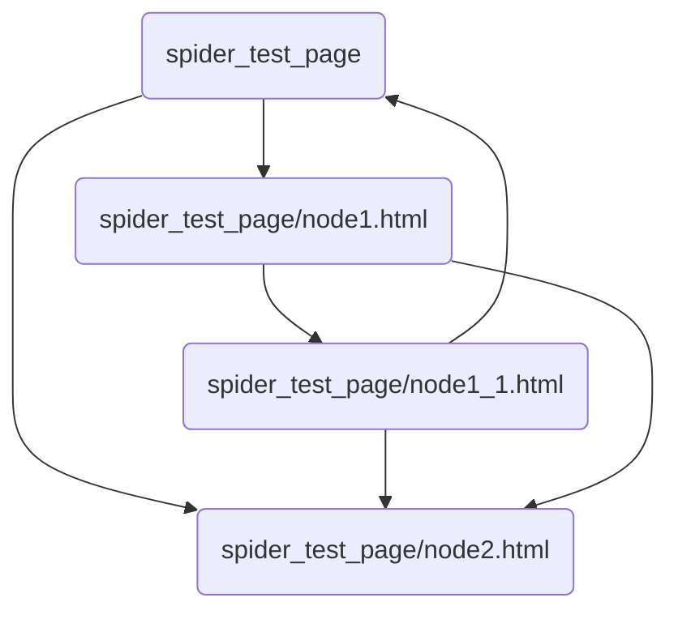

# Spider Test Page

## Spider Graph:



```json
[
  {
    "url": "https://niortizva.github.io/spider_test_page",
    "points_to": [
      "https://niortizva.github.io/spider_test_page/node1.html",
      "https://niortizva.github.io/spider_test_page/node2.html"
    ]
  },
  {
    "url": "https://niortizva.github.io/spider_test_page/node1.html",
    "points_to": [
      "https://niortizva.github.io/spider_test_page/node1_1.html",
      "https://niortizva.github.io/spider_test_page/node2.html"
    ]
  },
  {
    "url": "https://niortizva.github.io/spider_test_page/node1_1.html",
    "points_to": [
      "https://niortizva.github.io/spider_test_page",
      "https://niortizva.github.io/spider_test_page/node2.html"
    ]
  },
  {
    "url": "https://niortizva.github.io/spider_test_page/node2.html",
    "points_to": [
      "https://niortizva.github.io/spider_test_page/node1_1.html"
    ]
  }
]
```
